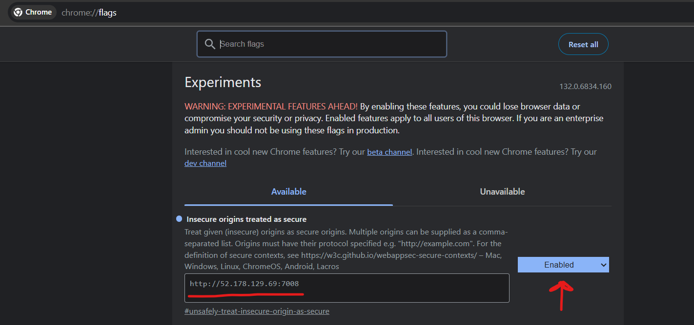

<div align="center">

  
  
  
<!-- Badges -->
<p>
  <a href="https://github.com/OpariucRares/Web-News-Provenance/graphs/contributors">
    
  </a>
  <a href="">
    
  </a>
  <a href="https://github.com/OpariucRares/Web-News-Provenance/network/members">
    
  </a>
  <a href="https://github.com/OpariucRares/Web-News-Provenance/stargazers">
    
  </a>
  <a href="https://github.com/OpariucRares/Web-News-Provenance/issues/">
    
  </a>

  <a href="https://github.com/OpariucRares/Web-News-Provenance/blob/main/LICENSE">
    
  </a>
  <!-- https://creativecommons.org/licenses/by-nc-sa/4.0/ -->
  <a href="https://github.com/OpariucRares/Web-News-Provenance/blob/main/CC-BY-NC-SA-4.0.txt">
  
</a>

</p>
   
<h4>
    <a href="https://www.youtube.com/watch?v=6C-EiTA4_pI/">View Demo</a>
  <span> · </span>
    <a href="https://github.com/OpariucRares/Web-News-Provenance/tree/main/docs/scholarly-report">Documentation</a>
  <span> · </span>
    <a href="https://github.com/OpariucRares/Web-News-Provenance/issues/">Report Bug</a>
  <span> · </span>
    <a href="https://github.com/OpariucRares/Web-News-Provenance/issues/">Request Feature</a>
  </h4>
</div>

<br />

<!-- Table of Contents -->

# :notebook_with_decorative_cover: Table of Contents

- [About the Project](#star2-about-the-project)
  - [Screenshots](#camera-screenshots)
  - [Tech Stack](#space_invader-tech-stack)
  - [Features](#dart-features)
  - [Color Reference](#art-color-reference)
  - [Environment Variables](#key-environment-variables)
- [Getting Started](#toolbox-getting-started)
  - [Prerequisites](#bangbang-prerequisites)
  - [Installation](#gear-installation)
  - [Deployment](#triangular_flag_on_post-deployment)
- [Usage](#eyes-usage)
- [Contributing](#wave-contributing)
- [License](#warning-license)
- [Contact](#handshake-contact)
- [Acknowledgements](#gem-acknowledgements)

<!-- About the Project -->

## :star2: About the Project

- [Scholarly HTML Report](docs/scholarly-report/index.html)
- [Open API Documentation](https://app.swaggerhub.com/apis/OpariucRares/web-news-provenance/v1)
- [Link to the hosted application](https://article-atlas-cha7c4e8e5ghhqdz.northeurope-01.azurewebsites.net/)

<!-- Screenshots -->

### :camera: Screenshots

<div align="center"> 
  
  
  
</div>

<!-- TechStack -->

### :space_invader: Tech Stack

<details>
  <summary>Client</summary>
  <ul>
    <li><a href="https://www.typescriptlang.org/">Typescript</a></li>
    <li><a href="https://vitejs.dev/">Vite</a></li>
    <li><a href="https://reactjs.org/">React.js</a></li>
    <li><a href="https://mui.com/">MUI</a></li>
    <li><a href="https://getbootstrap.com/">Bootstrap</a></li>
  </ul>
</details>

<details>
  <summary>Server</summary>
  <ul>
    <li><a href="https://learn.microsoft.com/en-us/dotnet/csharp/">C#</a></li>
    <li><a href="https://dotnet.microsoft.com/en-us/apps/aspnet/apis">.NET API</a></li>
    <li><a href="https://dotnetrdf.github.io/">dotNetRDF</a></li>
  </ul>
</details>

<details>
<summary>Database</summary>
  <ul>
    <li><a href="https://jena.apache.org/">Apache Jena</a> (TBD)</li>
  </ul>
</details>

<details>
<summary>DevOps</summary>
  <ul>
    <li><a href="https://github.com/features/actions">GitHub Actions</a></li>
    <li><a href="https://azure.microsoft.com/en-us/services/app-service/web/">Azure Web App</a></li>
  </ul>
</details>

<!-- Features -->

### :dart: Features

Pages and Their Features:
Home Page:

- Displays a collection of article cards.
- Allows users to interact by searching for articles or viewing them directly.
- Pagination to navigate through the articles.

Article Details Page:

- Provides detailed information about each article, including the source, image, Title, Creator, Author, Date, Language, Description, Category, URL, Article Content, Wikidata URL, and embedded content (such as PDFs, websites, etc.).
- Displays recommended articles at the bottom of the page based on the category.

Advanced Search Page

- Allows users to apply various filters to search for articles based on specific criteria such as language, category, author name, and date.
- Pagination to navigate through the search results.

SPARQL Page:

- Provides a SPARQL endpoint that returns data in RDF, JSON-LD, and tabular formats.
- Allows users to download the data in multiple formats, such as RDFa, CSV, and JSON-LD.
  Statistics Page:
- Features interactive visualizations and statistics about the data: number of articles by language, category. Number of articles in years based on category and language.
- Statistics can be downloaded in both .png and .svg formats.

  <!-- Color Reference -->

### :art: Color Reference

| Color           | Hex     |
| --------------- | ------- |
| Primary Color   | #1263B4 |
| Secondary Color | #F8F9FA |
| Accent Color    | #0C4F92 |
| Text Color      | #212529 |

<!-- Env Variables -->

### :key: Environment Variables

To run this project, you will need to add the following environment variables to your .env file

`VITE_BASE_API`

<!-- Getting Started -->

## :toolbox: Getting Started

<!-- Prerequisites -->

### :bangbang: Prerequisites

This project uses .NET, Apache Jena and Node.js together with Typescript

- .NET 8 SDK: [Download and install .NET 8](https://dotnet.microsoft.com/download/dotnet/8.0)
- Apache Jena and Fuseki server: [Installation guide](https://jena.apache.org/documentation/fuseki2/fuseki-quick-start.html)
- Node.js (for frontend): [Download and install Node.js](https://nodejs.org/)

<!-- Installation -->

### :gear: Installation

#### Backend

1. Clone the project:
   ```bash
   git clone https://github.com/OpariucRares/Web-News-Provenance
   ```
2. Run the Fuseki Server
   ```bash
   java -jar fuseki-server.jar
   ```
3. Add the data from the data folder using the UI of the server (default is localhost:3030)

4. Go to the project directory:
   ```bash
   cd backend/WebNewsProvenance
   ```
5. Install the .NET dependencies:
   ```bash
   dotnet restore
   ```
6. Run the backend server:
   ```bash
   dotnet run
   ```

#### Frontend

7. Go to the project directory:
   ```bash
   cd frontend/react-vite
   ```
8. Install dependencies:
   ```bash
   npm install
   ```
9. Start the frontend server:
   ```bash
   npm run build
   ```

<!-- Deployment -->

### :triangular_flag_on_post: Deployment

How we deployed the app

1. Push to the main branch to trigger the deployment pipeline.

2. GitHub Actions will automatically build and deploy your application.

Backend

1. The backend is hosted on an Azure VM running the Apache Fuseki Jena server and .NET 8 application.

2. Ensure the VM is configured correctly and all necessary ports are open.

Frontend

1. The frontend is hosted on an Azure Web App.

2. Configuration and environment variables can be set via the Azure Portal.

<!-- Usage -->

## :eyes: Usage

## Known issue
Our frontend is hosted on the Web App is secured (uses
https), but the backend is still hostthe VM and is not
secured (uses http).

Because of that, the website will rejecunsecured resources
and the webpage will be empty. To seresources, you need to
add a special option in your browser.
Enter the chrome://flags in the searchenable the option
"Insecure origins treated as secure" anthe backend API http://52.178.129.69:7008.
  <div> 
   
  </div>

Imagine a platform that not only lets you explore captivating stories, articles, and multimedia content from around the world but also allows you to trace the origins and transformations of each piece of information, ensuring transparency and credibility.

Whether you're a researcher, journalist, educator, or simply a curious reader, this web application offers a rich multimedia experience, advanced search capabilities, and personalized recommendations.

With support for multiple languages and enriched metadata from sources like DBpedia and Wikidata, you'll discover content you never knew existed. Dive into a world of knowledge with an intuitive and powerful tool that brings the best of the digital news landscape to your fingertips. Intrigued? Let's explore the possibilities together!

In [Scholarly HTML Report](docs/scholarly-report/index.html) there is a user guide on how to use the application.

<!-- Contributing -->

## :wave: Contributing

<a href="https://github.com/OpariucRares/Web-News-Provenance/graphs/contributors">
  
</a>

Contributions are always welcome!

See `contributing.md` for ways to get started.

<!-- FAQ -->

## :warning: License

The source code for this project is licensed under the [MIT License](LICENSE-MIT).

The data provided in this repository is licensed under the [Creative Commons Attribution 4.0 International License (CC BY 4.0)](CC-BY-NC-SA-4.0.txt).

You are free to use, modify, and share the source code and data according to the terms of these licenses. Please ensure you provide proper attribution where necessary.

<!-- Contact -->

## :handshake: Contact

Opariuc Rareș Ioan - opariucraresioan@gmail.com

Tablan Andrei-Răzvan - andreitablan01@gmail.com

Project Link: [https://github.com/OpariucRares/Web-News-Provenance](https://github.com/OpariucRares/Web-News-Provenance)

<!-- Acknowledgments -->

## :gem: Acknowledgements

Use this section to mention useful resources and libraries that you have used in your projects.

- [Shields.io](https://shields.io/)
- [Awesome README](https://github.com/matiassingers/awesome-readme)
- [Emoji Cheat Sheet](https://github.com/ikatyang/emoji-cheat-sheet/blob/master/README.md#travel--places)
- [Readme Template](https://github.com/othneildrew/Best-README-Template)
- [dotNetRDF](https://github.com/dotnetrdf/dotnetrdf)
- [MUI (Material-UI)](https://mui.com/)
- [Wikidata Query Service](https://query.wikidata.org/)
- [DBpedia SPARQL Endpoint](https://dbpedia.org/sparql/)
- [The London Gazette SPARQL Endpoint](https://www.thegazette.co.uk/sparql)
